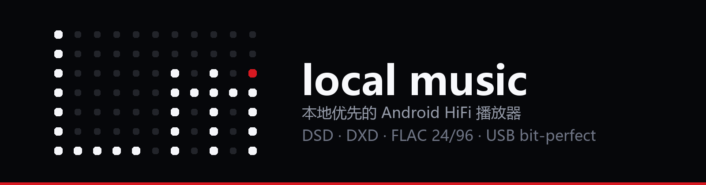

<p align="center">
  
</p>

<h1 align="center">local music</h1>

<p align="center">
  <b>Local-first</b> · dot-matrix Lm identity · liquid glass everywhere · bit-perfect output
</p>

<p align="center">
  <a href="LICENSE"></a>
  <a href="https://github.com/chengxixian/local-music/releases"></a>
  
  
  
  
  
  
</p>

> [中文版 README](README.md) · **English** (this file)

A local-first Android HiFi music player. It scans your own storage, converts NetEase
`.ncm` files to FLAC/MP3, scrapes cover art and lyrics, and plays back through a float-PCM
path with bit-perfect output. The UI is liquid glass throughout, navigated with an
iPod-style click wheel.

The playback core is ported from [Rueded/AURALIS](https://github.com/Rueded/AURALIS)
(GPL-3.0). The glass UI uses [chengxixian/liquid-miuix](https://github.com/chengxixian/liquid-miuix).
`.ncm` decoding is ported from [taurusxin/ncmdump](https://github.com/taurusxin/ncmdump).

### Screenshots

| Library (real specs on every card) | Player (blurred-cover background) | Playlists |
|---|---|---|
|  |  |  |

### Audio formats

| Class | Formats | Notes |
|---|---|---|
| Lossless / hi-res PCM | **FLAC, WAV, ALAC (m4a)** | Real specs are read and shown per track; verified with **24-bit/96 kHz** material |
| High sample rate PCM | **up to 384 kHz / 32-bit** | Includes **DXD (24-bit/352.8 kHz)** — it is PCM, so it goes through the FLAC/WAV path |
| Lossy | MP3, AAC (m4a), OGG, Opus | Regular playback |
| **DSD** | `.dsf` / `.dff` | ✅ **Playable, converted to PCM**: the app parses DSF/DFF headers itself (DSD64/128/256) and decimates the 1-bit stream to **176.4 kHz/24-bit PCM** with two cascaded 4:1 boxcar stages (an equivalent 16-tap triangular window). The result is cached, and the converted PCM can still go out through USB bit-perfect. **Not** native DSD / DoP passthrough — Android's public API has no isochronous USB audio, so that is not possible here |

> On bit-perfect: output is pinned to the **USB DAC** (`setPreferredAudioDevice`), and on
> Android 14+ the app requests `AudioMixerAttributes(MIXER_BEHAVIOR_BIT_PERFECT)` matching the
> source format. When granted, the system mixer is bypassed and the equalizer is bypassed with
> it. Otherwise playback falls back to the system mixer (audible, but no longer bit-perfect).
> **Bluetooth is lossy and resamples, so hi-res has to go over USB.** The USB path is
> implemented but **not verified on real hardware** — I have no DAC to test with.

### Features

| Module | Notes |
|---|---|
| Library | Two-column portrait cards (square art on top, title/specs below); MediaStore + SAF folders + app-private storage, de-duplicated by real path |
| Playback | Media3 ExoPlayer with `DefaultAudioSink(enableFloatOutput)`; `MediaSessionService`; USB DAC bit-perfect on Android 14+ with automatic fallback |
| Queue | Tap to jump, reorder, remove; the `+` button on a card appends to the current queue |
| `.ncm` conversion | FLAC when verification passes, else published as `flac-unverified-raw`; MP3 payloads fall back to a raw `.mp3`. Exportable to a folder of your choice, named `Artist - Title` |
| Scraping | Covers: NetEase → iTunes → Deezer; lyrics: NetEase → LRCLIB. Only fills gaps, throttled in batches, never overwrites embedded artwork |
| Lyrics | Timestamped LRC with line highlighting and auto-scroll; scraped cache → sibling `.lrc` → embedded comments |
| Equalizer | System audiofx (EQ / bass boost / loudness), bound to the playback session |
| Click wheel | Rotate to move, single click on the center cycles pages, double click confirms; arc-length stepping with 45 ms haptic throttling |
| Tinted glass | The wheel ring can take a tinted glass: 7 presets plus a hue / saturation / transmission picker, modelled as real absorption |
| Player background | The current cover, scaled up and blurred (20 dp, saturation 0.42), drawn **inside the capture layer** so the glass ring, control panel and dock refract that blurred cover |
| About page | A dedicated page behind one settings entry: dot-matrix logo, version, action row, and grouped credits / community / legal sections; the donation QR only appears after tapping Donate |
| App icon | A project-owned dot-matrix `Lm` mark: adaptive icon without the red dot, plus legacy PNGs with it. Generated by `scripts/make-dotmatrix-icon.py` |
| Playlists | Second dock tab, two-column cards; create / rename / change cover / delete. Without a custom cover it uses the **first track's artwork** |
| Updates | Checks `version.json` on GitHub raw 3 s after launch and offers a one-tap download with progress and the system installer |

### Quick start

```bash
gradle :app:assembleDebug          # -> app/build/outputs/apk/debug/app-debug.apk
adb install -r app/build/outputs/apk/debug/app-debug.apk
```

Requirements: JDK 17, Android SDK with compileSdk 37 / targetSdk 36 / minSdk 33 (Android 13+).

### Repository layout

```
app/            Android app (Compose UI, data layer, scraping, playlists)
audio/          Playback service, USB bit-perfect, .ncm decoding
scripts/        Icon generation, API-based git push
docs/           Banner, icon, screenshots
NOTICE          License boundaries: code is GPL-3.0, brand assets are All Rights Reserved
```

> Note: `:liquid-miuix` currently points at a local checkout of the glass library via
> `projectDir` in `settings.gradle.kts`. Point it at your own copy of
> [liquid-miuix](https://github.com/chengxixian/liquid-miuix) before building.

### Known limitations

- **No real DSD passthrough.** DSD is decimated to PCM (see above); native DSD/DoP would
  require a USB Audio Class driver over the fd from `UsbDeviceConnection`, which is a
  separate, much larger project.
- **DSD over USB is not verified end-to-end** — the code path exists, but I have no DSD
  material and no DAC to test with. The app can *probe* whether a connected DAC advertises
  bit-perfect DSD (`AudioFormat.ENCODING_DSD` + `MIXER_BEHAVIOR_BIT_PERFECT`) and reports the
  result honestly in the playback diagnostics (logcat tag `LMDsd`).
- **Localization covers four languages** (English, Simplified Chinese, Japanese, Russian): every user-facing string lives in `res/values*/strings.xml`, and the language can be changed in Settings (glass dialog) or via the Android 13+ per-app language setting. Diagnostic and log strings in the data layer are still Chinese.
  means extracting them into `strings.xml` first.
- NetEase scraping uses undocumented endpoints: it may be rate-limited, region-dependent, and
  serves copyrighted content — personal local use only.

### License and brand

Code is **GPL-3.0** (the playback core derives from GPLv3 AURALIS). The app icon, in-app
dot-matrix mark, banner and screenshots are this project's **own designs and are All Rights
Reserved** — fork the code freely, but please do not reuse the icons. See [NOTICE](NOTICE).
© 2026 chengxixian.