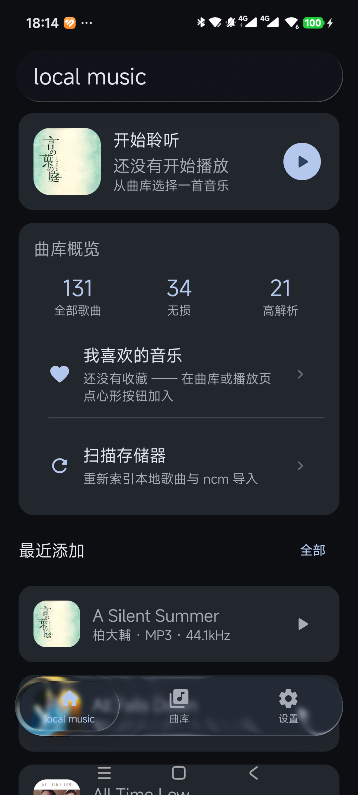
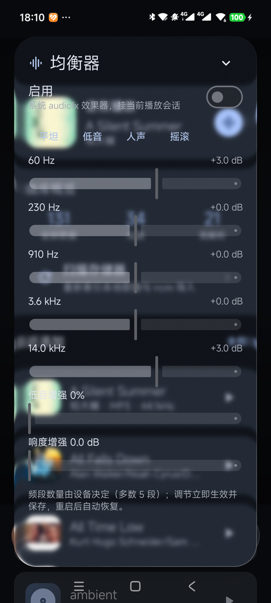
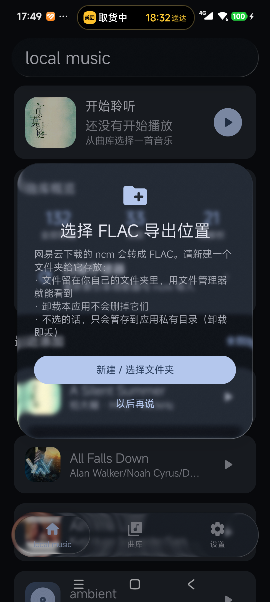
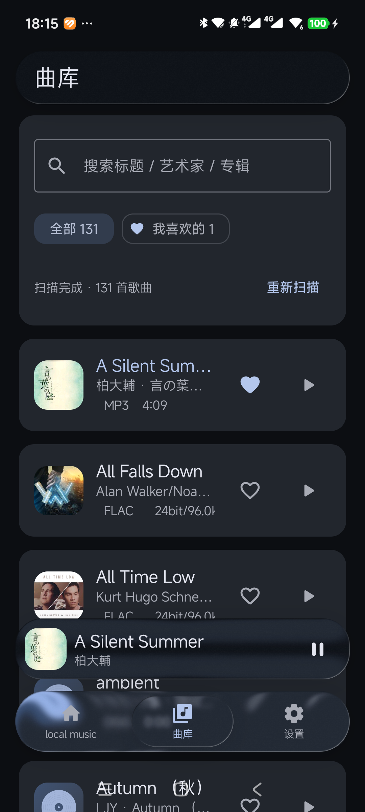

<p align="center">
  
</p>

<h1 align="center">local music</h1>

<p align="center">
  本地优先的 Android 高解析音乐播放器：曲库来自设备上的本地文件，<code>.ncm</code> 在设备内转成 FLAC，
  PCM 按文件原始采样率送往 USB DAC。
</p>

<p align="center">
  <b>中文</b>（本文件） · <a href="README.en.md">English</a>
</p>

<p align="center">
  <a href="LICENSE"></a>
  <a href="https://github.com/chengxixian/local-music/releases"></a>
  
  
  
  
</p>

播放内核移植自 [Rueded/AURALIS](https://github.com/Rueded/AURALIS)（GPL-3.0），
液态玻璃界面使用 [chengxixian/liquid-miuix](https://github.com/chengxixian/liquid-miuix)（已内置在 `third_party/`），
`.ncm` 解码移植自 [taurusxin/ncmdump](https://github.com/taurusxin/ncmdump)。


## 功能

### 音频格式

| 类别 | 格式 | 说明 |
|---|---|---|
| 无损 / 高解析 PCM | FLAC、WAV、ALAC(m4a) | 扫描阶段读文件头取得真实位深与采样率（系统媒体库接口常把 96kHz 报成 48kHz），曲库卡片与播放页按曲目展示 |
| 有损 | MP3、AAC(m4a)、OGG Vorbis、Opus、AMR | 由 Media3 ExoPlayer 解码 |
| DSD | `.dsf` / `.dff` | 设备内解码：自研 DSF/DFF 头解析（DSD64/128/256）+ 两级 4:1 箱式平均（等价 16 点三角窗），抽取为 **176.4kHz/24bit PCM**，首次转换后缓存；转出的 PCM 可继续走 USB 直通。**不是**原生 DSD / DoP 直通 |
| 网易云容器 | `.ncm` | 设备内解密与转换，不联网；见下方「功能一览」中的 `.ncm` 转换 |

### 功能一览

| 模块 | 说明 |
|---|---|
| 曲库 | 两列竖卡片网格（上半正方形封面，下半歌名与规格行），卡片角上有喜欢 / 加入乐单 / 播放按钮；来源为 MediaStore 各存储卷、用户授权的 SAF 目录、应用私有目录，按真实路径去重 |
| 搜索 | 顶栏搜索框按标题 / 艺术家 / 专辑过滤当前列表；播放页队列面板同样可搜索。播放队列跟随过滤后的列表，不会跳到搜索结果之外 |
| 播放 | Media3 ExoPlayer + `DefaultAudioSink(enableFloatOutput = true)`；`MediaSessionService` 提供后台播放与系统媒体通知（上一项 / 播放 / 下一项） |
| 播放队列 | 点行跳播、调整顺序、移除；卡片上的 `+` 追加到当前队列；队列取自当前页面显示的列表（曲库 / 乐单 / 喜欢），点歌保留乱序设置；播放完一轮回到第一首（默认列表循环，可切换 关 / 列表 / 单曲） |
| USB 直通 | 自研 UAC2 等时输出（JNI + usbfs），按文件原始采样率设置 DAC 时钟并读取设备异步反馈调速；详见 [USB 直通](#usb-直通) |
| `.ncm` 转换 | 内封装 FLAC → 逐字节还原，无损、零重编码；内封装 MP3 → 解码后写成合法 FLAC 流，侧车 JSON 以 `payloadFormat` 如实标注；FLAC 校验不通过时仍发布但标记 `flac-unverified-raw`，MP3 转 FLAC 失败时直接落原始 `.mp3`；可发布到自选的 SAF 文件夹，文件名取「艺术家 - 歌名」 |
| 封面 | 优先用户自选图片 → 系统缩略图 → 文件内嵌封面；自选图片复制进应用私有目录，与原始文件解耦；缩略图按尺寸落盘缓存 |
| 歌词 | 带时间戳 LRC 逐行高亮 + 自动滚动（当前行取当前歌曲封面的主题色）；来源顺序为刮削缓存 → 同目录 `.lrc` → 文件内嵌歌词 |
| 自动刮削 | 封面：网易云音乐 → iTunes → Deezer；歌词：网易云音乐 → LRCLIB。只补缺、分批节流、不覆盖歌曲自带的封面，并可一键恢复自带封面 |
| 乐单 | dock 第二栏进入，两列竖卡片；新建 / 重命名 / 换封面 / 删除；未自选封面时用乐单第一首歌的封面，空乐单回落点阵标记 |
| 喜欢 | 曲库与播放页的心形按钮，独立的喜欢列表与其对应的播放队列 |
| 均衡器 | 系统 `android.media.audiofx`（均衡 / 低音增强 / 响度增强），挂在当前播放会话上；频段数由设备决定（多数 5 段）；USB 直通开启时系统混音被旁路，面板会明确提示当前不生效 |
| 液态玻璃界面 | 采集层 + 玻璃层结构：玻璃顶栏、dock 悬浮胶囊、迷你播放条、播放页封面光环与控件面板；播放页背景是当前封面放大 + 高斯模糊，画在采集层之内，因此各处玻璃折射到的就是这层模糊封面 |
| 滚轮 | iPod 式点击轮：转环选上一项 / 下一项（环上弧长计步、每帧最多一格、短震反馈节流），单击中间键按 曲库 → 乐单 → 喜欢 → 设置 循环切页，双击确认（播放选中歌曲 / 执行选中设置项） |
| 有色玻璃滚轮 | 滚轮圆环可换色：8 个预设（无色 + 7 个色相）与自定义（色相 / 饱和度 / 透光率），按吸光模型实现，只影响滚轮圆环 |
| 多语言 | English / 简体中文 / 日本語 / Русский，界面文案全部走资源文件（英文为默认兜底）；设置页可切换，也支持 Android 13+ 的按应用语言 |
| 应用图标 | 自有设计的点阵 `Lm` 标识：`mipmap-anydpi-v26/` 自适应图标（无红点）+ `mipmap-<dpi>/` PNG 兜底（带红点） |
| 更新检查 | 「关于 → 检查更新」手动触发，读取仓库里的 `version.json`（GitHub raw，不占用 REST API 配额）；发现新版本时显示下载进度并交给系统安装器 |
| 关于页 | 独立页面：点阵标识与版本、源码 / 检查更新 / 项目说明 / 捐赠入口，以及产品、社区、法律三组信息 |


## 截图

| 主页 | 曲库 | 播放页 |
|---|---|---|
| <br><sub>曲库概览与最近添加</sub> | <br><sub>两列卡片，标出真实格式与位深 / 采样率</sub> | <br><sub>封面模糊背景与玻璃控件</sub> |
| <br><sub>乐单：两列卡片</sub> | <br><sub>均衡器玻璃面板</sub> | <br><sub>`.ncm` 导出目录提示</sub> |

<details>
<summary>更多截图（音乐库列表）</summary>

| 音乐库（搜索与喜欢筛选） |
|---|
|  |

</details>


## 构建

### 环境要求

| 项 | 要求 |
|---|---|
| JDK | 17（`sourceCompatibility` / `jvmTarget` 均为 17） |
| Android SDK | `compileSdk 37`、`targetSdk 36`、`minSdk 33`（Android 13+） |
| Gradle | 9.4.1 及以上（仓库内含 wrapper） |
| Android Gradle Plugin | 9.2.1（AGP 9 起已内置 Kotlin 支持，不要再声明 `org.jetbrains.kotlin.android`） |
| Kotlin / Compose 插件 | 2.4.20 |
| NDK | 28.2.13676358（仅 `:audio` 的原生 USB 等时模块需要） |

### 构建与安装

```bash
gradle :app:assembleDebug          # 产物 app/build/outputs/apk/debug/app-debug.apk
adb install -r app/build/outputs/apk/debug/app-debug.apk
gradle :audio:testDebugUnitTest    # :audio 的单元测试
```

<details>
<summary>依赖、测试样本与构建说明</summary>

- 依赖全部来自 Google Maven 与 Maven Central；`:liquid-miuix` 由仓库内的 `third_party/liquid-miuix` 提供，构建不需要额外拉取该 UI 库。
- `settings.gradle.kts` 的仓库列表把镜像排在前面，海外环境可以删掉镜像行。
- wrapper 的 `distributionUrl` 指向镜像地址，可自行改为官方 Gradle 发行地址。
- release 构建未配置独立签名，本项目的 Release 使用 debug 构建产物。
- NCM 回归测试使用的 `test.ncm` 来自上游 ncmdump、属第三方版权内容，不随仓库分发（见 `.gitignore`）：需要时从
  `taurusxin/ncmdump` 取 `test/test.ncm` 放到 `audio/src/test/resources/ncm/test.ncm`，未提供时相关用例自动跳过。
- 真实文件回归用例需要环境变量 `LM_NCM_REAL_FILE` 指向一个 `.ncm` 文件，未设置时跳过。

</details>


## 项目结构

```
app/                        Android 应用模块（:app）
  src/main/java/com/localmusic/app/
    MainActivity.kt         采集层 / 玻璃层结构、dock、滚轮与页面切换
    data/                   曲库扫描、数据库、封面缓存、歌词、刮削、乐单、喜欢、更新检查、DSD 解码
    ui/                     液态玻璃组件、播放页、设置与各玻璃面板、点击轮
audio/                      音频模块（:audio）
  src/main/java/com/localmusic/audio/ncm/        .ncm 解密、FLAC 校验、导出与命名
  src/main/java/com/localmusic/audio/playback/   Media3 播放服务、均衡器、UAC2 控制与等时流、PCM 解码
  src/main/cpp/usbisoc.c                         原生 USB 等时输出（usbfs URB 提交 / 回收 + 异步反馈调速）
third_party/liquid-miuix/   内置的液态玻璃 Compose 库，以 :liquid-miuix 引入
docs/                       横幅、图标与截图
scripts/                    图标生成与素材渲染脚本（Python）
version.json                应用内更新检查读取的清单
NOTICE                      授权边界说明
```


## USB 直通

Android 的 Java USB API（`UsbRequest`）只支持 control / bulk / interrupt，对等时端点调用
`initialize()` 直接失败；而音频流必须是等时传输。因此本项目自带一层最薄的 USB Audio Class 2 输出实现。

| 环节 | 做法 |
|---|---|
| fd | Kotlin 侧用 `UsbDeviceConnection.getFileDescriptor()` 取得 usbfs 原始 fd |
| 传输 | 原生层（`audio/src/main/cpp/usbisoc.c`，编成 `libusbisoc.so`）用 `USBDEVFS_SUBMITURB` / `USBDEVFS_REAPURB` 提交与回收等时 URB，每个 URB 带 1 个 iso packet（USB 高速 125µs 一帧），固定保持若干 URB 在飞以避免 underflow |
| 设备能力 | 解析 UAC2 类描述符：时钟源、各 alt setting 的位深与采样率表；设备的可用采样率取自系统 `AudioDeviceInfo` 的音频配置 |
| 时钟 | 用 `SET_CUR` 把 DAC 时钟设到**文件原始采样率**（不做重采样），再用 `GET_CUR` 读回校验；激活 alt setting 之后再设一次 |
| 码率 | 每帧字节数 = 采样率 × 4 字节（32bit 子帧）× 声道数 ÷ 8000 帧每秒，并对齐到整采样帧，避免左右声道错位 |
| 异步反馈 | 若设备带反馈端点，原生层解析其 Q16.16 速率并据此微调每帧字节数（保留完整小数部分累加），防止周期性丢样 / 重复 |
| 数据通路 | `MediaCodec` 解码 → 统一转成 32bit 小端 PCM → 管道 → 原生等时写出 → DAC；发送前有垃圾数据安全闸，接近满量程的样本占比异常时主动中止，避免把噪音送进 DAC |
| 会话 | 同一时刻只允许一条直通；停止时关闭管道写端，让原生 `read` 返回 0 后释放接口；只有仍是当前所有者的会话才允许释放接口，避免并发会话互相抢接口 |
| 界面 | 设置页「USB 直通」开关；曲库点歌即直通；直通期间 ExoPlayer 被静音但仍负责界面、队列与进度 |

### 直通的两条边界

- **DAC 不支持的采样率直接拒绝**：设备只上报自己支持的采样率（例如只有 48kHz 家族而没有 44.1kHz），
  文件采样率不在其中时不做直通、也不重采样，而是明确提示。
- **未完成硬件端到端验证**：代码能确认的只是系统与设备接受了请求，没有用测量设备核对模拟输出，
  因此界面文案按「请求已被接受」措辞，而不是「已测得位完美」。


## 已知限制

- **USB 直通缺少测量级验证**：没有测量设备核对 DAC 的模拟输出，界面与文档都只声明「请求被接受」；
  未连接兼容 DAC 时会显示等待连接，不会假装直通已生效。
- **只对部分 UAC2 设备验证过**：采样率能力完全取自所连设备上报的信息，DAC 不支持的采样率会被拒绝
  （宁可不出声，也不硬播走调或噪音）。
- **DSD 不是原生直通**：`.dsf` / `.dff` 解码为 PCM 后播放；Android 公开 API 没有等时 USB 音频，
  原生 DSD / DoP 需要单独的驱动实现。对 DAC 是否支持 bit-perfect DSD 只做能力探测，
  结果如实写在诊断日志里（logcat 标签 `LMDsd`）。
- **高解析必须走 USB**：蓝牙链路本身有损且会重采样；不满足直通条件时回落到系统混音（能听，但不再位完美）。
- **元数据刮削使用非官方接口**：网易云音乐接口未公开、无需账号，可能被限流、随地区不同或直接失效
  （失效时回落到 iTunes / Deezer / LRCLIB）；接口返回内容的版权归原服务方，仅限本地个人使用。
- **`.ncm` 转 FLAC 不提升音质**：内封装 MP3 的有损音源转成 FLAC 只是容器变化，侧车 JSON 的
  `payloadFormat` 会如实标注；校验不通过的载荷标记为 `flac-unverified-raw`。
- **均衡器依赖系统 audiofx**：设备没有实现时，面板只说明不可用；USB 直通开启时系统混音被旁路，均衡器不生效。
- **更新走应用内下载**：需要 `REQUEST_INSTALL_PACKAGES` 权限，APK 下载后交给系统安装器；Release 使用 debug 签名。
- **本地化范围**：界面文案覆盖四种语言；数据层的诊断与日志文案仍为中文。
- **Android 版本**：应用最低 Android 13（API 33）；USB bit-perfect 相关的系统级请求需要 Android 14（API 34）及以上。


## 许可

- **代码**：以 **GNU GPL-3.0** 授权（见 [LICENSE](LICENSE)）。播放内核移植自同样以 GPL-3.0 发布的 AURALIS，
  因此衍生作品同样需要以 GPL-3.0 发布并保留版权声明。
- **品牌标识**：应用图标（`app/src/main/res/mipmap-*`、`mipmap-anydpi-v26/`、`drawable-nodpi/ic_launcher_foreground.png`）、
  `docs/banner.png`、`docs/app-icon.png`、`docs/screenshots/` 下的全部截图，以及应用内的点阵 `Lm` 标记，
  是本项目自主设计的标识，**不在上述 GPL 授权范围内，保留所有权利**：可以 fork 代码、修改并自行发行，
  在文章或评测中引用这些图形时注明来源即可；但请不要把同款或高度近似的图标 / 横幅用作自研应用的标识，
  也不要借此暗示与本项目存在关联或得到本项目作者背书。
- 项目名称 "local music" 与上述图形标识目前**未申请商标注册**；NOTICE 中的「保留所有权利」是基于著作权的主张，
  不构成商标注册。
- 「`.ncm` 转换」与「在线刮削」功能仅用于用户自己合法拥有的本地音乐，请遵守相关服务条款与当地法律。
- 全文见 [NOTICE](NOTICE)。


## 第三方

| 项目 | 用途 | 许可 / 说明 |
|---|---|---|
| [Rueded/AURALIS](https://github.com/Rueded/AURALIS) | 播放内核来源 | GPL-3.0；`:audio` 的解码链路、输出与真实规格解析移植自此 |
| [chengxixian/liquid-miuix](https://github.com/chengxixian/liquid-miuix) | 液态玻璃界面库 | 已内置在 `third_party/liquid-miuix`，以 `:liquid-miuix` 引入 |
| [taurusxin/ncmdump](https://github.com/taurusxin/ncmdump) | `.ncm` 解码 | 移植；许可文本见 [LICENSE-ncmdump.txt](LICENSE-ncmdump.txt) 与 `audio/.../ncm/LICENSE.ncmdump.txt` |
| Media3 / ExoPlayer 1.10.0 | 解码与播放 | Apache-2.0 |
| Miuix | Compose 组件 | Apache-2.0 |
| jaudiotagger 3.0.1 | 读取真实位深 / 采样率 | 见 [NOTICE](NOTICE) 与 `app/build.gradle.kts` |
| kotlinx-coroutines | 并发 | 见 `app/build.gradle.kts` |
