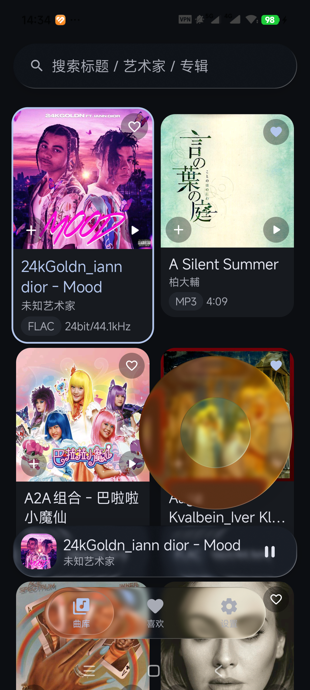
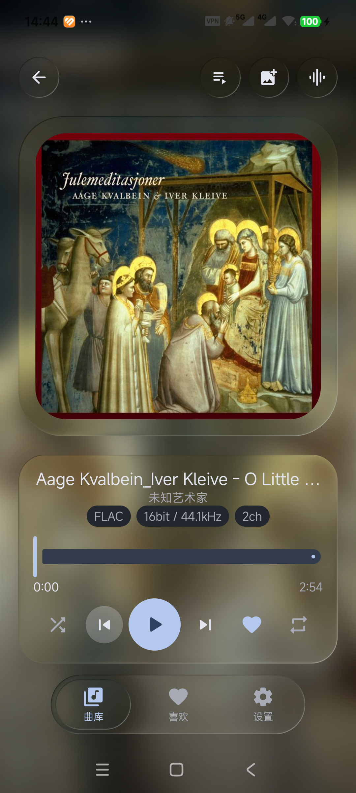
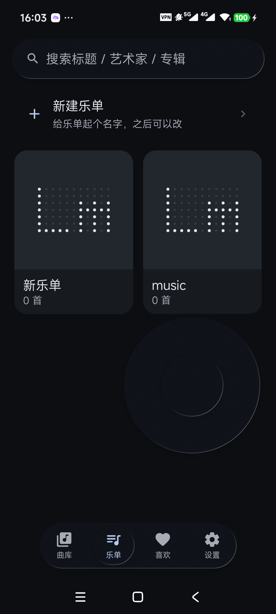

# local music

安卓本地 HiFi 音乐播放器。**播放内核移植自 [Rueded/AURALIS](https://github.com/Rueded/AURALIS)**，
**前端使用 [chengxixian/liquid-miuix](https://github.com/chengxixian/liquid-miuix)**，
**ncm 解码移植自 [taurusxin/ncmdump](https://github.com/taurusxin/ncmdump)**。





> 工程位置（开发机）：`D:\dsh work region\local-music`
> 前端库引用的是工作区里已 clone 的 `liquid-miuix-repo/library`（`projectDir` 直接指过去，没有复制代码）；
> 单独 clone 本仓库时，把 `settings.gradle.kts` 里 `:liquid-miuix` 的路径指到你自己那份库即可。

---

## 项目介绍

一个**本地优先**的 Android HiFi 播放器：扫描你自己的存储、把网易云 `.ncm` 转成 FLAC/MP3、自动刮削封面与歌词，播放内核支持 float PCM 直通（bit-perfect），界面是全套液态玻璃 + 一个 iPod 式滚轮。

**面向高品质音源**：曲库卡片与播放页直接标出每首歌的真实规格（格式 / 位深 / 采样率 / 声道），高解析 PCM 一路送到 USB DAC 走 bit-perfect 直通。

### 支持的音频格式

| 类别 | 格式 | 说明 |
|---|---|---|
| 无损 / 高解析 PCM | **FLAC、WAV、ALAC(m4a)** | 曲库识别并展示真实规格，实测 **24bit/96kHz**（截图里的徽章就是曲库自己读出来的） |
| 高采样率 PCM | **最高 384kHz / 32bit** | 含 **DXD（24bit/352.8kHz）**——它本质是 PCM，走 FLAC/WAV 通道即可播放 |
| 有损 | MP3、AAC(m4a)、OGG、Opus | 常规播放 |
| **DSD** | `.dsf` / `.dff` | ✅ **支持播放（转码为 PCM）**：自己解析 DSF/DFF 文件头（DSD64/128/256、位率、声道、时长），用两级 4:1 箱式平均（16 点三角窗）抽成 **176.4kHz/24bit PCM** 再送播放链，结果缓存（首次转码，之后直读）；转好的 PCM 能继续走 USB bit-perfect 直通。**不是**原生 DSD / DoP 直通 —— Android 公开 API 没有等时 USB 音频，做不到 |

> 关于 bit-perfect：**输出优先指定给 USB DAC**（`setPreferredAudioDevice`），并在 Android 14+ 按源规格申请 `AudioMixerAttributes(MIXER_BEHAVIOR_BIT_PERFECT)`；直通时绕开系统混音，均衡器自动旁路。更低版本或设备不支持时回落系统混音（能听，但不再"位完美"）。**蓝牙链路本身有损并会重采样，高解析必须走 USB。** USB DAC 直通我在真机上**没有 DAC 可测**，这条只有实现、没有实测证据。


- 包名 `com.localmusic.app`，Android 13+（compileSdk 37 / targetSdk 36 / minSdk 33）
- 许可 **GPL-3.0**（因为播放内核移植自 GPLv3 的 AURALIS）

### 功能一览

| 模块 | 说明 |
|---|---|
| 曲库 | 两列竖卡片网格（上半正方形封面、下半歌名信息）；MediaStore + SAF 授权文件夹 + 应用私有目录，按真实路径去重 |
| 播放 | Media3 ExoPlayer + `DefaultAudioSink(enableFloatOutput)`，`MediaSessionService`；USB DAC 在 Android 14+ 按源 PCM 规格申请 **bit-perfect**，不支持时自动回落系统混音 |
| 播放列表 | 点行跳播、↑↓ 调序、✕ 删除；曲库卡片左下角 `+` 追加到当前队列 |
| ncm 转换 | 输出阶梯：FLAC 校验通过→`.flac`；校验失败→仍发布并标记 `flac-unverified-raw`；MP3 载荷转 FLAC 失败→直接落原始 `.mp3`。可导出到自选文件夹（SAF），文件名取「艺术家 - 歌名」 |
| 自动刮削 | 封面：网易云音乐 → iTunes → Deezer；歌词：网易云音乐 → LRCLIB。只补缺、分批节流；**不覆盖歌曲自带的封面**（读文件内嵌图判定），并可一键"恢复自带封面" |
| 歌词 | 带时间戳 LRC 逐行高亮 + 自动滚动；优先刮削缓存，其次同目录 `.lrc`，最后内嵌注释 |
| 均衡器 | 系统 audiofx（均衡 / 低音增强 / 响度增强），绑定播放会话 |
| 滚轮 | 转环选上一项/下一项（环上弧长计步、每帧最多一格、45ms 触感节流）；**单击**中间键按 曲库→设置→喜欢 循环切页，**双击**确认（播放选中歌曲 / 执行选中设置项） |
| 有色玻璃 | 滚轮圆环可换有色玻璃：7 个预设 + 调色盘（色相 / 饱和度 / 透光率），按真实"吸光"模型实现 |
| 播放页背景 | 当前封面放大 + 高斯模糊（20dp、饱和度降到 42%），画在**采集层之内**，因此封面光环 / 控件面板 / dock 的玻璃折射到的就是这层模糊封面 |
| 关于页 | 设置里只留一个入口，点进去是独立一页：居中点阵 logo + 版本、动作行（源码 / 检查更新 / 项目说明 / 捐赠）、产品 / 社区 / 法律信息三组清单；捐赠点开才弹出支付宝二维码 |
| 应用图标 | Nothing 风格点阵 `Lm`：`mipmap-anydpi-v26/` 自适应（无红点）+ `mipmap-<dpi>/` 原始 PNG 兜底（带红点）；字形由 `scripts/make-dotmatrix-icon.py` 生成 |
| 自动更新 | 启动 3s 后查 `version.json`（GitHub raw，免 API 限流）；有新版本弹玻璃面板，一键下载（显示百分比 / 已下载 · 总大小）并拉起系统安装 |
| 乐单 | dock 第二栏进入，两列竖卡片（封面 / 名称 / 曲目数）；新建、重命名、换封面、删除。未自选封面时**自动用乐单第一首歌的封面**，空乐单回落点阵标记 |
| 加入乐单 | 曲库与喜欢页的卡片**左上角**（与右上角的心形成一对）：点一下弹出玻璃面板，勾选即加/去，也能现场新建并加入 |

### 快速开始

```bash
gradle :app:assembleDebug          # 产物 app/build/outputs/apk/debug/app-debug.apk
gradle :audio:testDebugUnitTest    # ncm 解码 / 逐帧 CRC / 真实坏文件回归
```

---

## 一、需求对照

| # | 需求 | 落点 |
|---|---|---|
| 1 | 用 AURALIS 作后端做 HiFi 播放器，支持 mp3 / aac 等主流格式 | `audio/.../playback/PlaybackService.kt`：Media3 ExoPlayer + `DefaultAudioSink(enableFloatOutput=true)`；Android 14+ 接 USB DAC 时按源 PCM 规格申请 `AudioMixerAttributes(MIXER_BEHAVIOR_BIT_PERFECT)`；格式覆盖面由 ExoPlayer 决定：mp3 / aac(m4a) / flac / wav / ogg-vorbis / opus / alac / amr |
| 2 | liquid-miuix 实现莫奈取色主页 + 液态玻璃播放控件与 dock | `app/.../MainActivity.kt`（采集层/玻璃层结构）、`ui/Glass.kt`（玻璃面板 / 玻璃圆钮）、`ui/PlayerOverlay.kt`（封面玻璃光环 + 控件面板 + 玻璃图标钮）、`ui/Pages.kt`、`ui/EqualizerSheet.kt`。主题走 `LiquidTheme()` 默认的 **Monet 动态取色**（跟随壁纸） |
| 3 | 自动扫描存储器里的歌曲 | `app/.../data/LibraryRepository.kt`：MediaStore 各存储卷 + 用户授权的 SAF 目录树 + 应用私有目录；`ContentObserver` 监听媒体库变化，进入应用扫一次并每 60s 复查 |
| 4 | ncmdump 把网易云下载的音乐自动转 FLAC，存到**用户选择的**目录 | `audio/.../ncm/`：`NcmDecoder`（算法移植）、`NcmFileStore`（校验+原子落盘）、`NcmExport`（发布到用户选的 SAF 文件夹）、`NcmNaming`（文件名取「艺术家 - 歌名」）；首次打开弹**液态玻璃**提示窗让用户新建/选择导出文件夹 |
| 5 | 软件名 local music | `app/src/main/AndroidManifest.xml` 的 `android:label="local music"` |
| 6 | 我喜欢的音乐（收藏） | `app/.../data/FavoritesStore.kt` + `MusicDatabase.favorites`；曲库页「全部 / 我喜欢的」筛选、每行心形按钮、播放页心形按钮、主页入口 |
| 7 | 封面用缩略图、可自定义封面 | `ui/Artwork.kt`（系统缩略图 → 降采样 → 磁盘/内存两级缓存）+ `data/CoverStore.kt`（自选图片复制进私有目录并记录映射） |
| 8 | 点封面显示歌词 | `ui/PlayerOverlay.kt` 的歌词面板 + `data/LyricsRepository.kt`（同名 `.lrc` 或内嵌歌词，带时间戳则自动滚动高亮） |
| 9 | 均衡器 | `audio/.../playback/EqualizerController.kt`（系统 audiofx：Equalizer / BassBoost / LoudnessEnhancer，按播放会话绑定）+ `ui/EqualizerSheet.kt`（液态玻璃面板；设置页与播放页均有入口） |

### 关于「ncm 转 FLAC」的两点实话

1. **内封装 FLAC 的**（网易云无损下载）：逐字节还原，**无损、零重编码**，只是去掉 NCM 外壳。
2. **内封装 MP3 的**：解码成 PCM 后写成**合法 FLAC 流**——是真正的转码，不是改后缀。
   但**有损音源转成 FLAC 不会恢复丢失的音质**，这点在侧车 JSON 的 `payloadFormat` 字段里明确标注。

### 封面与歌词的来源（都不是"偷偷联网"）

- **封面**：优先用户自选的图片 → 系统缩略图（`ContentResolver.loadThumbnail`）→ 音频内嵌封面。
  自选图片会被**复制进应用私有目录**，原图删了、SAF 授权被回收了也不影响。
- **歌词**：只读本地来源 —— 与音频**同目录同名**的 `.lrc`，或音频文件里**内嵌**的歌词（ID3 USLT / Vorbis LYRICS）。
  不请求任何在线歌词接口。
  ⚠️ 同名 `.lrc` 属于"非媒体文件"，Android 11+ 下**只有在用户授权的目录里才读得到**
  （媒体库里的歌想读旁边那个 .lrc，需要「所有文件访问权限」，本项目不申请）。
  所以：把 `.lrc` 放进你授权过的音乐目录（例如网易云那个目录，或 FLAC 导出目录）最稳。

### 均衡器的边界

- 走系统 `android.media.audiofx`，挂在**当前播放会话**上，不是自研 DSP；所有解码路径自动生效。
- **开启 USB 直通时系统混音被绕过，均衡器不生效**——界面会明确提示"当前不生效"，而不是假装有效。
- 频段数量由设备决定（多数 5 段）；调节立即生效并保存，重启后自动恢复。

---

## 二、构建

本机工具链在 `D:\tool`（JDK 17 / Android SDK compileSdk 37 / Gradle 9.4.1 / NDK）。

```powershell
# 载入工具链环境（本机执行策略为 Restricted，必须用 ScriptBlock 方式）
$sb = [ScriptBlock]::Create((Get-Content "D:\tool\env.ps1" -Raw)); & $sb

cd "D:\dsh work region\local-music"
gradle :app:assembleDebug --console=plain          # 产物 app/build/outputs/apk/debug/app-debug.apk
gradle :audio:testDebugUnitTest --console=plain    # NCM 解码器的真实样本回归测试
```

版本约束（不要随意改，会被 miuix 0.9.4 的 AAR 元数据拦下）：
AGP 9.2.1 · Gradle 9.4.1+ · Kotlin 2.4.20 · compileSdk 37 · minSdk 33 · material3 1.5.0-alpha22。

---

## 三、存储与权限（这部分是 Android 的限制，不是实现偷懒）

- **MediaStore**：授权 `READ_MEDIA_AUDIO` 后可读全部共享存储音频（`app/.../data/LibraryRepository.kt`）。
- **SAF 授权目录**：Android 11+ 起，**任何应用都无法直接读取 `Android/data/<其它应用>/`**，
  网易云的下载目录（`Android/data/com.netease.cloudmusic/...`）对第三方应用不可见。
  所以 ncm 的自动转换作用于**用户在设置里授权的文件夹**（`ACTION_OPEN_DOCUMENT_TREE`，
  持久化读权限）。请把网易云下载的 `.ncm` 放到 `Music/` 或 `Download/` 后再授权该目录。
- **应用私有目录**：转换结果落在 `filesDir/music/ncm/`（=`/data/data/com.localmusic.app/files/music/ncm`），
  这是应用自己的 data 目录，不需要任何存储权限，随应用卸载一起清除。
- **网易云下载的 ncm 在哪**：一般在 `Download/netease/cloudmusic/Music/`；
  写在 `Android/data/com.netease.cloudmusic/` 里的那部分受系统保护，任何第三方应用都读不到。
  另外 **Download 根目录本身被系统禁止授权**（选择器会提示"无法使用此文件夹"），
  所以要授权它的**子目录**。授权成功一次后权限会持久化，之后每次扫描都会自动转换新出现的 ncm。

---

## 四、已知限制

- **DSD（.dsf/.dff）不能播放**：ExoPlayer 没有 DSD 解码器；这类文件会被扫描元数据但无法出声。
  AURALIS 上游同样只能标注、不能解码。
- **USB Bit-perfect 是"请求已接受"而非硬件测量证明**：界面文案按此措辞。
  仅 Android 14+ 且外接 DAC 且 DAC 支持与源一致的采样率/编码组合时才会申请直通；
  条件不满足一律回落系统混音，不做"抬到最高采样率"这种假直通。
- **未在模拟器上验证**：本机没有安装 emulator 系统镜像；验证是在真机（小米 25019PNF3C / Android 17 / HyperOS）上做的，记录见下节。
- **USB Bit-perfect 未在有 DAC 的场景下验证**：手头没有 USB DAC，无法确认"请求被接受后确实走了直通"。
  代码在无 DAC 时会明确显示"等待连接兼容 USB DAC"，不会假装已开启。

---

## 五、真机验证记录（2026-09-28，小米 25019PNF3C / Android 17）

| 项 | 结果 | 证据 |
|---|---|---|
| 安装启动 | 通过，无崩溃 | `adb install` Success；pid 存活；logcat 无 `FATAL/AndroidRuntime` |
| 自动扫描存储器 | 通过 | 曲库 131→134 首；DB 中 `media:external_primary` 132 首 |
| 真实位深/采样率 | 通过 | 列表显示 `FLAC 24bit/96.0kHz`（系统 API 常误报 48kHz，这里是 jaudiotagger/STREAMINFO 的结果） |
| 播放链路 | 通过 | `dumpsys audio`：`package:com.localmusic.app type:android.media.AudioTrack`、`format update:FormatInfo{sampleRate=96000}`、HAL `sample_rate 96000, format 0x5`(PCM_FLOAT) |
| 后台播放 | 通过 | media3 `MediaSessionService`，系统通知带"上一项/播放/下一项"三个按钮 |
| SAF 授权目录 | 通过 | DB 出现 `tree/primary%3ADownload%2Flocal%20music` 来源的歌曲 |
| ncm → 真 FLAC | 通过 | `files/music/ncm/ncm-a1586b….flac`（155,727 B）+ 侧车 JSON；用独立 Python 脚本按规范解析：`16bit 44100Hz 2ch samples=176400`，文件 sha256 `973bb281…` |
| 转换结果入库命名 | 通过 | 曲库出现「贝贝 / 李荣浩 · 耳朵 / FLAC 16bit/44.1kHz 0:04」——名字来自侧车元数据，不是哈希文件名 |
| 原文件保留 | 通过 | 授权目录里的 `贝贝.ncm` 仍在 |
| 界面 | 通过 | 见 `shots/local-music/`：莫奈取色主页、玻璃 dock（滑动高亮胶囊）、玻璃迷你播放条、全屏玻璃播放器 |
| USB Bit-perfect | **未验证** | 无 USB DAC 设备 |

截图目录：`D:\dsh work region\shots\local-music\`。

---

## 六、第二轮改动（2026-09-28，按使用反馈）

| 反馈 | 处理 |
|---|---|
| 深色模式下歌名是黑的，看不清 | 根因：Material3 的 `Text` 取 `LocalContentColor`，而它默认是**黑色**；我们的文字大量放在 miuix `Card` 里（不是 material3 `Surface`，没人给它赋值），于是深色下黑字黑底。现在在 `AppShell` 顶层统一 `LocalContentColor provides MiuixTheme.colorScheme.onSurface` → 浅色黑、深色白，跟随主题 |
| 「local music」那个顶部色块也要液态玻璃 | 顶栏从 Scaffold 的 `topBar` 槽移出来，做成**采集层之外**的玻璃浮层（`GlassTopBar`）；页面内容不再为它留高度，而是从它下面滚过去，玻璃才有东西可折射。细长条的折射量单独调小（16/26dp），否则整条糊成一团 |
| 用提供的图当图标 | `design/app-icon-source.jpg` → `scripts/make-app-icon.py`（Pillow）→ 自适应图标：前景缩到安全区 56%，背景取源图四角底色 `#001830`；`mipmap-anydpi-v26/ic_launcher(.round).xml`。圆形/方形裁切预览见 `shots/local-music/icon-preview.png` |
| 点击「开始聆听」的播放按钮没反应 | 根因：没选中曲目时 `player.id == null`，回调里 `if (playback.id != null)` 直接吞掉了点击。现在：有当前曲目→打开播放器；没有→**真的开始播第一首**并打开播放器；按钮图标也随之切换（播放/波形） |
| 封面别用原图、用缩略图；滑动卡顿 | 重写 `Artwork`：① 先问系统要缩略图（`ContentResolver.loadThumbnail`，比解内嵌图快一个量级）；② 拿不到才用 `MediaMetadataRetriever` 且**立刻按目标尺寸降采样**（`inSampleSize` + RGB_565）；③ 按「URI+目标尺寸」落盘到 `cacheDir/artwork`（48MB 预算，超了按时间淘汰）；④ 列表 160px、全屏播放器 900px，是不同缓存条目 |
| 曲库里有重复歌 | 同一个物理文件既被 MediaStore 收录、又在授权目录里，会出现两条。现在按**真实路径**去重（MediaStore 那趟记 `_data`，SAF 那趟把 `documentId` 还原成路径比对）：394 首 → **282 首** |

### 实测数据（同机、同曲库）

| 项 | 结果 |
|---|---|
| 滑动帧统计（冷缓存第一轮，1130 帧） | **Janky frames 5（0.44%）**，50th 12ms / 90th 29ms / 95th 32ms，Missed Vsync 2 |
| 缩略图缓存 | `cache/artwork` 23 个文件 348KB；其中 **22 个**能精确对应到真实歌曲的 `sha1(uri@160)` 键 |
| 去重效果 | 授权目录来源的音频条目 0 条（全部与媒体库重复，已合并）；`private`（ncm 转出）149 条 |

### ncm 校验器的一处放宽（附一个真实反例）

规范说「比 STREAMINFO 里 `minBlockSize` 更短的帧只能是最后一帧」。实测有网易云资源不满足这一点。
原先直接判死，现在改为**只计数不判死**——因为真正的完整性由三件事守住：逐帧 header CRC8 + 帧 CRC16、
采样序号连续、总采样数与 STREAMINFO 完全相等（截断文件过不了这一关）。

同一批文件里也确实有**真的坏**的：`宇多田ヒカル - Distance.ncm`（40,895,197 B）能正常解密
（载荷 `fLaC` 开头、元数据与声明时长都读得出），但帧流中途失同步 → 校验器拒绝、UI 如实报错、
**不产出半成品 FLAC**。这条行为已固化成回归测试（`NcmRealFileRegressionTest`，用环境变量指向该文件）：

```powershell
$env:LM_NCM_REAL_FILE = "...\宇多田ヒカル - Distance.ncm"
gradle :audio:testDebugUnitTest --tests "*NcmRealFileRegressionTest*"
# -> 校验器按预期拒绝：Invalid FLAC frame sync
```

### 本轮测试

```
:audio:testDebugUnitTest  →  7 个用例，0 失败
  NcmDecoderTest 5/5（真实样本 test.ncm：16bit 44.1kHz，逐帧 CRC 通过）
  NcmRealFileRegressionTest 1/1（上面那个真实坏文件，断言"必须拒绝"）
  NcmDumpToolTest 1（默认跳过，需 LM_NCM_FILE/LM_NCM_DUMP 环境变量）
```

### 顺带说明（未改动代码的两点）

- 本机上「自动转换 ncm → FLAC」开关**已被我关掉**（`settings.xml` 里 `autoNcm=false`），
  免得它接着把剩下 100 多个 ncm 也转掉；代码里的默认值仍是**开**。要用时在「设置」里打开即可。
- 授权目录与 `files/music/ncm` 里已经有 **149 个转换产物、约 4.7GB**（内部存储）。
